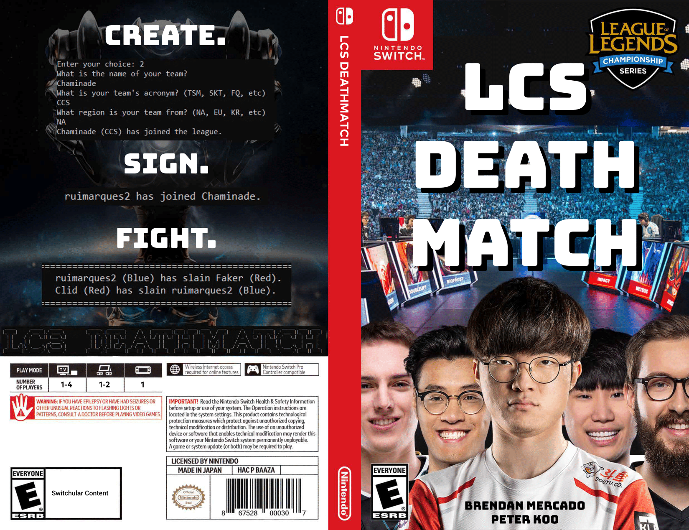

# LCS Deathmatch

LCS Deathmatch is a text-based, team management simulation game created in Java that is based on [League of Legends](https://www.leagueoflegends.com/en-us/) and its esports scene[^1]. This game was created as the ISU for my Grade 12 ICS4U class as a way to practice OOP fundamentals.

## Features

- Create your own players and teams or use prepopulated rosters with pro players
    - View player stats and make roster changes
    - Remove players from the league
- Pit two teams against each other in a simple 20-40s simulation of a League of Legends game
    - Every second, either team has a chance to gain a kill/point based on team stats
    - The team with the most kills at the end of the match is the winner
- View the league's overall standings

https://github.com/Riceria/lcs-deathmatch/assets/49005248/efad8858-e189-4f53-ad82-9d69e1e20ae1

---

[^1]: Professional players depicted in the game and their respective teams were accurate during January 2020

Link to the game's [manual](media/manual.pdf). Box art was made in [Adobe Photoshop](https://www.adobe.com/ca/products/photoshop.html) and all original images belong to their respective creators.
